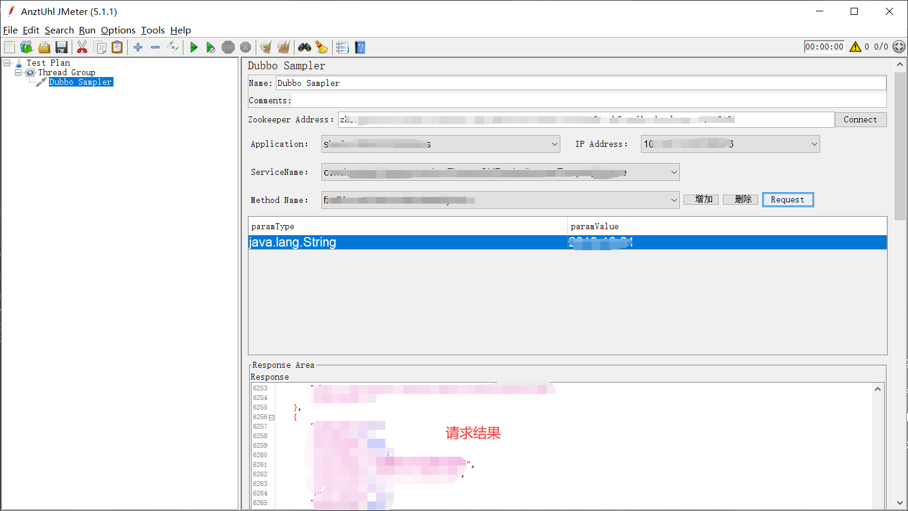

<h1 align="center"></h1>
<h4 align="center">Open Source application designed to load test applications and measure performance. By The Apache Software Foundation. modify by @AntzUhl</h4>
 

## What has been upgraded

1. 支持dubbo服务接口压测

## Effect

1. Optional Config

修改`bin`目录下`jmeter.properties`文件。

目前支持的配置如下:

| configName | value |
| --------- | --------- |
| show_application | 配置你关心的application(为空加载所有) |
| default_zk_addr | 默认zookeeper地址(为空需要启动后手动填写) |

2. Start

启动后添加一个线程组，然后再添加`Dubbo Sampler`。

点击connect同步服务信息，选择要调用的服务，IP地址，以及方法，填写参数信息。

点击`Request`或`JMeter`的测试按钮。

## TODO 

1. 参数列表自动提示